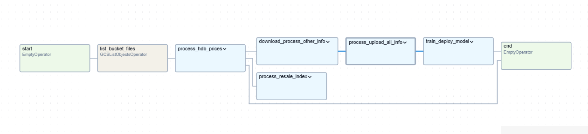
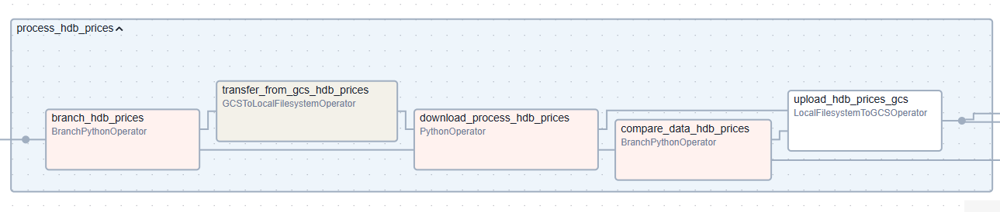
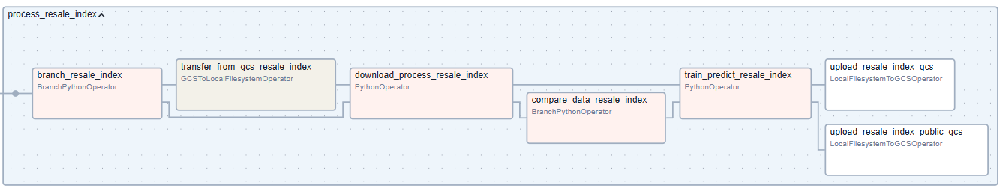
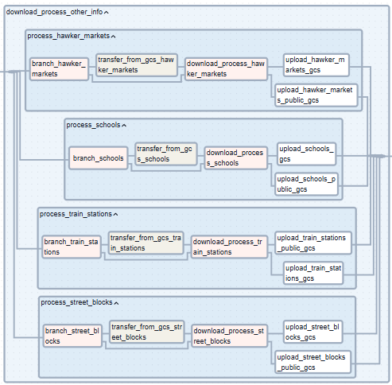
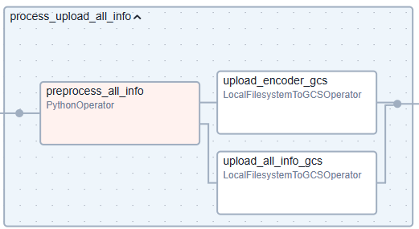
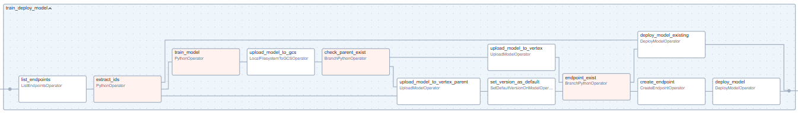

# HDB Resale Price Prediction MLOps Pipeline

## Overview
This Apache Airflow pipeline implements an automated MLOps workflow for predicting HDB (Housing & Development Board) resale prices in Singapore. The pipeline handles data ingestion, processing, model training, and deployment to Google Cloud Platform's Vertex AI.

## Web App
This pipeline serves the prediction coming from **https://resale-price-predictor.streamlit.app/**

The code for the web app can be found in https://github.com/leeyide96/predictor-streamlit

## Entire Pipeline Visualization

*Pipeline DAG showing the main task groups and their dependencies*

## Pipeline Structure
The pipeline consists of five main task groups:

1. **Process HDB Prices**

   - Downloads and processes HDB resale transaction data
   - Compares new data with existing data to determine if updates are needed
   - If no update is needed, it will skip the remaining pipeline
   - Uploads processed data to Google Cloud Storage

    
2. **Process Resale Index**

   - Handles HDB resale price index data
   - Trains time series models for price index prediction
   - Updates both private and public storage buckets

3. **Download & Process Other Information**

   - Processes supporting datasets including:
     - Street blocks
     - Train stations
     - Schools
     - Hawker markets
   - Each subcomponent will compare new data with existing data to determine if updates are needed
   - Updates both private and public buckets with processed data

4. **Process & Upload All Info**

   - Combines all processed datasets
   - Generates and stores encoders for categorical variables
   - Prepares final dataset for model training

5. **Train & Deploy Model**

   - Trains a new Random Forest model
   - Handles model versioning in Vertex AI
   - Creates/updates endpoints for model serving
   - Manages model deployment and traffic routing

## Key Features
- Automated daily execution (runs at 00:05)
- Data update detection
- Version control for ML models
- Automated model deployment
- Public data management

## Technical Details
- **Cloud Platform**: Google Cloud Platform
- **Model Serving**: Vertex AI
- **Storage**: Google Cloud Storage
- **Airflow Server**:
  - **GCP Resource**: Compute Engine
  - **Machine Type**: n1-standard-2
  - **Region**: asia-southeast1
- **Public Endpoint for Prediction**: Cloud Function

## Dependencies
- Docker
- Apache Airflow
- Google Cloud providers for Airflow
- Python scientific computing stack (for model training)
- Custom processing modules:
  - preprocess_data
  - train_ts
  - train_model
  - utils

